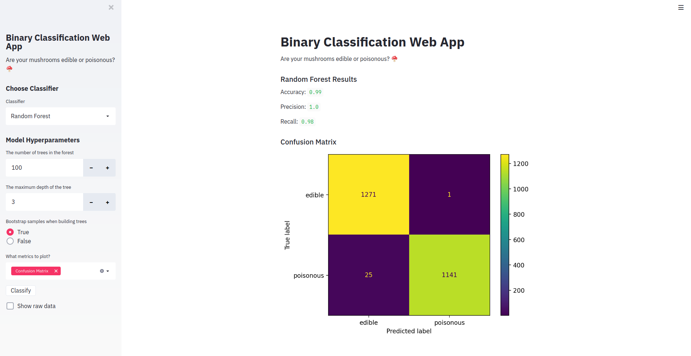

## Interactive Dashboard with Streamlit and Python
This is a web application that allows the users to choose what classification algorithm they want to use and let them interactively set hyper-parameter values, all without them knowing to code! It's built entrirely with the Streamlit library in Python.

### How to Run?

Create a virualenv:  
`conda create -n myenv python=3.6`

Activate:  
`conda activate myenv`

Install Requirements:  
`pip install -r requirements.txt`

Run:  
`streamlit run app.py`
